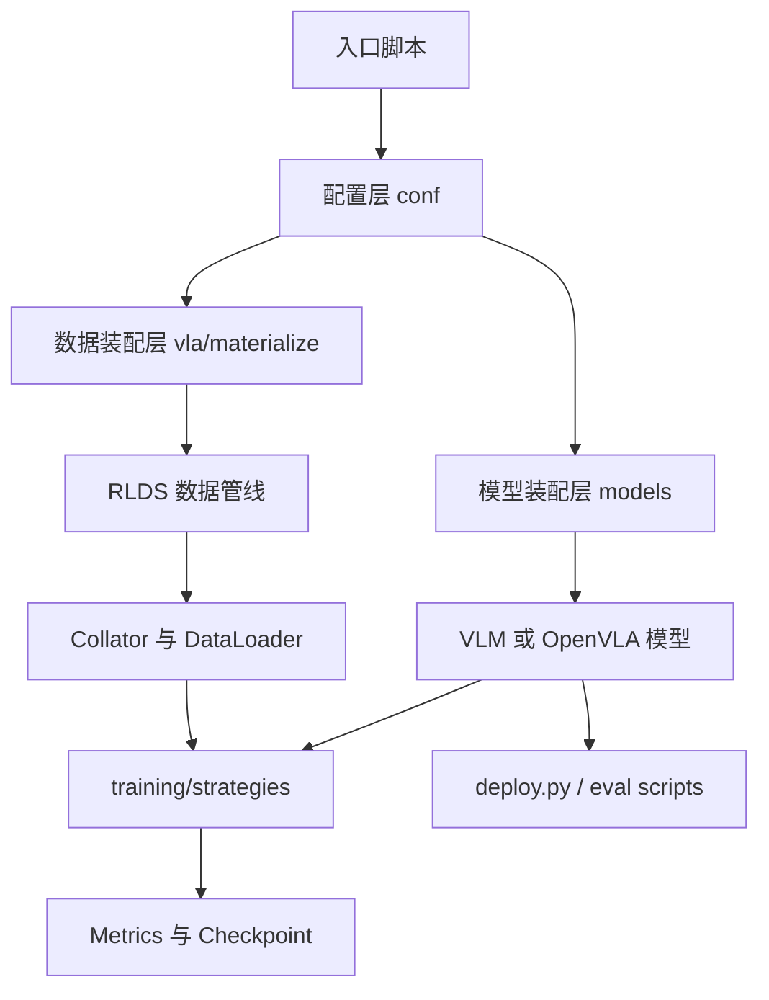

# OpenVLA 项目结构与运行逻辑分析

本文档基于仓库源码、README 和论文摘要，对 OpenVLA 的工程结构、运行逻辑以及关键文件职责做一份面向开发者的中文解读。重点不是逐行解释代码，而是回答三个问题：

1. 这个项目在工程上是怎么分层的。
2. 一次训练、微调、推理、部署和评测分别会经过哪些模块。
3. 不同目录和关键文件分别负责什么。

## 1. 项目定位

OpenVLA 是一个面向机器人操控的 Vision-Language-Action 模型工程。

从论文目标看，它要做的事情是：

- 输入机器人当前视觉观测和自然语言指令。
- 输出连续控制动作。
- 支持在大规模真实机器人演示数据上训练。
- 支持在新任务和新平台上继续微调。

从工程实现看，它并不是完全从零写的一套系统，而是建立在 Prismatic VLM 之上的 VLA 扩展。这个继承关系非常重要：

- `Prismatic` 负责视觉 backbone、LLM backbone、投影器、通用 VLM 训练与加载。
- `OpenVLA` 在此基础上增加动作 token 化、动作反归一化、机器人数据处理和 VLA 训练入口。

因此，这个仓库本质上是“两层结构”：

- 下层是通用视觉语言模型框架。
- 上层是把机器人控制建模成 token 预测的 VLA 系统。

## 2. 顶层目录怎么理解

项目根目录可以按职责分成 6 个区域。

### 2.1 `prismatic/`

这是核心库层，绝大多数真正的模型、数据和训练逻辑都在这里。

- `conf/`: 配置定义与配置注册。
- `models/`: backbone、VLM、VLA 包装、模型加载与工厂逻辑。
- `vla/`: 动作 tokenizer、RLDS 数据集、VLA 数据 materialize。
- `training/`: 分布式训练策略、metrics、训练工厂。
- `preprocessing/`: 面向上游 VLM 数据预处理的工具。
- `util/`: batch、padding、随机种子等通用工具。
- `extern/hf/`: HuggingFace 兼容接口，支持 AutoClass 推理与微调。

### 2.2 `scripts/`

这是上游 Prismatic VLM 的保留脚本，偏向“视觉语言模型”而不是“机器人动作模型”。

- `generate.py`: 文本生成 REPL。
- `preprocess.py`: 预训练数据预处理。
- `pretrain.py`: VLM 预训练。

需要特别注意：README 已明确说明，现有 OpenVLA 模型主要训练为“生成动作”，因此用 `scripts/generate.py` 对 OpenVLA 检查点做语言生成并不是主用法。

### 2.3 `vla-scripts/`

这是 OpenVLA 的主入口层。

- `train.py`: 原生 PyTorch + FSDP 的全量 VLA 训练入口。
- `finetune.py`: 基于 HuggingFace + PEFT 的 LoRA 微调入口。
- `deploy.py`: 将 OpenVLA 暴露成 REST API 服务。

### 2.4 `experiments/`

这是评测与机器人实验层。

- `robot/libero/`: LIBERO 仿真评测。
- `robot/bridge/`: BridgeData V2 / WidowX 真实机器人评测。
- `robot_utils.py`, `openvla_utils.py`: 模型与动作调用的通用机器人侧辅助函数。

### 2.5 `additional-datasets/`

这里是额外数据脚本，主要面向视觉语言预训练数据，而不是 VLA 主训练环节。

### 2.6 `extern/`

放置权重转换和验证脚本，用于在 Prismatic 原生格式和 HuggingFace 格式之间转换或校验。

## 3. 一张图看整体结构



可以把它理解为：

- 入口脚本决定“现在要做什么”。
- 配置层决定“用什么模型、什么数据混合、什么训练策略”。
- `models/` 负责把视觉编码器、语言模型和投影层组装起来。
- `vla/` 负责把机器人数据变成模型真正能吃的 token 和 batch。
- `training/` 负责分布式训练执行、日志和 checkpoint。
- `experiments/` 和 `deploy.py` 负责把模型接到仿真、真实机器人或服务接口上。

## 4. 论文方法如何映射到工程实现

论文里的几个核心设计，在仓库里都有明确落点。

### 4.1 视觉编码器 + LLM

论文强调 OpenVLA 由视觉编码器和语言模型组合而成。在工程里：

- 视觉 backbone 在 `prismatic/models/backbones/vision/`。
- LLM backbone 在 `prismatic/models/backbones/llm/`。
- 两者的组装由 `prismatic/models/vlms/prismatic.py` 中的 `PrismaticVLM` 负责。

### 4.2 将动作建模成 token 预测

这是 OpenVLA 最关键的工程思想。

- 连续动作先被离散化成 token。
- 模型像做语言生成一样生成这些动作 token。
- 最后再把 token 解码回连续动作。

对应实现：

- `prismatic/vla/action_tokenizer.py`: 连续动作 <-> 离散 token。
- `prismatic/models/vlas/openvla.py`: 生成动作 token，并反归一化成真实动作。

### 4.3 大规模机器人演示数据训练

论文中使用 Open X-Embodiment 等真实机器人数据。工程上对应：

- `prismatic/vla/datasets/rlds/`: RLDS 数据接入与变换。
- `prismatic/vla/datasets/rlds/oxe/`: OXE 数据集注册、配置和数据混合定义。
- `prismatic/vla/materialize.py`: 根据 data mix 构造最终训练数据集和 collator。

### 4.4 可扩展训练

论文强调可扩展性。工程实现主要通过 FSDP 支撑：

- `prismatic/training/strategies/fsdp.py`: FSDP 训练策略。
- `vla-scripts/train.py`: 多卡/多节点训练入口。

## 5. 推理主链路

OpenVLA 的推理不是简单的“图片进、动作出”，中间有一条清晰的装配和转换链。

### 5.1 从哪里进入

OpenVLA 推理常见有两种进入方式：

- HuggingFace AutoClass 路径：README 示例和 `vla-scripts/deploy.py`。
- 仓库原生路径：`prismatic/models/load.py` 中的 `load_vla()`。

### 5.2 `load_vla()` 负责什么

`prismatic/models/load.py` 中的 `load_vla()` 是原生加载总入口，职责是：

1. 识别传入的是本地 checkpoint 还是 HuggingFace Hub 路径。
2. 读取 `config.json` 和 `dataset_statistics.json`。
3. 根据配置装配 vision backbone 和 LLM backbone。
4. 创建 `ActionTokenizer`。
5. 调用 `OpenVLA.from_pretrained(...)` 恢复权重。

其中 `dataset_statistics.json` 很关键，因为推理后的动作需要反归一化。

### 5.3 `OpenVLA.predict_action()` 做了什么

`prismatic/models/vlas/openvla.py` 中的 `predict_action()` 是动作推理核心。它的逻辑可以概括成：

```text
图像 + 指令
-> 构造 prompt: What action should the robot take to ...?
-> tokenizer 编码文本
-> vision transform 处理图像
-> 调用 generate 生成 action token
-> 取最后 action_dim 个 token
-> ActionTokenizer 解码回 [-1, 1] 的归一化动作
-> 结合数据集统计量 q01/q99 反归一化
-> 输出真实动作向量
```

这里能看出 OpenVLA 的本质：它并不是单独写了一套控制头，而是把控制问题压缩为语言模型的自回归 token 预测问题。

### 5.4 为什么需要 `dataset_statistics.json`

训练时动作通常被归一化。推理时如果不做反归一化，模型输出只是在标准化空间中的值，无法直接发送给机器人控制器。

因此每个训练 run 都会把数据集动作统计保存下来，供部署和推理时恢复真实动作尺度。

## 6. 训练主链路

全量训练主入口是 `vla-scripts/train.py`。这是最能代表 OpenVLA 运行逻辑的脚本。

### 6.1 训练入口做的事情

`vla-scripts/train.py` 的主流程如下：

1. 解析训练配置。
2. 初始化 CUDA 和分布式环境。
3. 生成 run 目录并保存配置。
4. 加载 base VLM 或恢复已有 VLA checkpoint。
5. 根据冻结策略确定当前训练 stage。
6. 构建 VLA 数据集、action tokenizer 和 collator。
7. 保存数据集统计量。
8. 创建训练策略对象。
9. 创建 metrics 记录器。
10. 进入训练循环并周期性保存 checkpoint。

### 6.2 为什么先加载 VLM 再训练 VLA

OpenVLA 不是从随机初始化开始训练控制模型，而是建立在已有视觉语言模型之上。

因此 `train.py` 中会：

- 没有恢复 checkpoint 时，调用 `load(cfg.vla.base_vlm, load_for_training=True)` 加载 base VLM。
- 恢复训练时，调用 `load_vla(...)` 恢复已有 OpenVLA。

这对应了论文里的核心思想：先利用通用视觉语言能力，再把它迁移到机器人动作建模上。

### 6.3 冻结策略怎么工作

`train.py` 会根据以下配置组合确定 stage：

- `vla-full-train`
- `vla-train`
- `vla-sandwich-train`
- `vla-last-layer-train`

本质上是在控制哪些模块可训练：

- 视觉编码器是否冻结。
- LLM 是否冻结。
- 是否只解冻最后一层。

这让仓库同时支持全量训练、部分微调和更节省算力的训练方式。

### 6.4 数据是怎么进模型的

训练数据入口在 `prismatic/vla/materialize.py` 的 `get_vla_dataset_and_collator()`。

它会创建三样东西：

- `RLDSDataset`
- `ActionTokenizer`
- `PaddedCollatorForActionPrediction`

其中职责划分非常清晰：

- `RLDSDataset`: 从 RLDS/TFDS 管线里持续吐出样本。
- `ActionTokenizer`: 把连续动作离散化。
- `Collator`: 把长度不同的 token 序列 padding 成 batch。

### 6.5 RLDS 数据管线怎么工作

`prismatic/vla/datasets/datasets.py` 中的 `RLDSDataset` 是 PyTorch 包装层，但真正的数据变换更靠下层。

完整链路大致是：

```text
RLDS 原始轨迹
-> 单数据集/多数据集配置
-> 轨迹级变换 traj_transforms
-> 帧级变换 obs_transforms
-> TFDS / RLDS iterator
-> RLDSBatchTransform
-> PaddedCollatorForActionPrediction
-> 模型 forward
```

这里有两个要点：

1. 这个仓库把 TFDS/RLDS 作为底层数据引擎，PyTorch 只是最外层训练接口。
2. 多数据集混合不是在训练循环里手写拼接，而是在 RLDS dataset 构造阶段完成。

### 6.6 `RLDSBatchTransform` 为什么关键

`RLDSBatchTransform` 是“把机器人样本翻译成语言建模样本”的桥。

它会把一个 RLDS 样本转成：

- `pixel_values`
- `input_ids`
- `labels`
- `dataset_name`

其中最关键的操作是：

- 用自然语言指令构造 prompt。
- 把动作编码成 token 串，作为回答部分。
- 在 `labels` 中屏蔽 prompt 部分，只对动作 token 计算 loss。

这一步非常准确地体现了 OpenVLA 的训练目标：

- 输入是视觉观测和文字指令。
- 监督信号只来自动作 token。

### 6.7 训练策略如何执行

`prismatic/training/materialize.py` 会根据配置选择训练策略，OpenVLA 主路径通常走 FSDP。

FSDP 策略层职责包括：

- 包装模型。
- 配置混合精度。
- 配置梯度检查点。
- 构建优化器和学习率调度器。
- 运行真正的训练循环。

也就是说，`train.py` 更多像 orchestration 层，而不是把所有训练细节都写在一个文件里。

### 6.8 指标怎么记录

`prismatic/training/metrics.py` 中的 `VLAMetrics` 负责记录：

- `loss`
- `l1_loss`
- `action_accuracy`
- `step_time`
- `learning_rate`

它支持：

- 本地 JSONL 记录。
- Weights & Biases 记录。

这个分层让训练循环不需要直接知道日志后端细节。

## 7. 轻量微调链路

`vla-scripts/finetune.py` 是另一条非常重要的路径。它不是走原生 Prismatic/FSDP 训练体系，而是走 HuggingFace + PEFT。

### 7.1 它和 `train.py` 的区别

`train.py` 侧重：

- 全量训练。
- 大规模分布式训练。
- 深度复用 Prismatic 内部训练策略。

`finetune.py` 侧重：

- 更轻量的任务适配。
- LoRA 微调。
- 可选 4-bit 量化。
- 基于 HuggingFace AutoClasses 的兼容训练路径。

### 7.2 运行逻辑

`finetune.py` 的主流程是：

1. 注册 OpenVLA 的 HF AutoConfig / AutoProcessor / AutoModel。
2. 从 HuggingFace 路径加载 processor 和 model。
3. 按需开启量化训练。
4. 按需包上 LoRA。
5. 用 `RLDSBatchTransform` 和 `RLDSDataset` 构造数据。
6. 用 DDP 包装模型。
7. 运行微调循环。

换句话说，`finetune.py` 复用了 OpenVLA 的数据表达方式，但不复用完整的 Prismatic 训练架构。

### 7.3 为什么这条路径重要

这正对应论文中“可高效微调”的主张：

- 不需要完整重训整个大模型。
- 可以用更小显存预算做任务迁移。
- 能和 HuggingFace 生态、PEFT 生态直接对接。

## 8. 部署链路

`vla-scripts/deploy.py` 提供的是服务化推理，而不是训练。

### 8.1 它做了什么

这个脚本启动一个 FastAPI 服务，暴露 `/act` 接口。

请求格式大致是：

```json
{
  "image": "numpy array",
  "instruction": "robot instruction",
  "unnorm_key": "optional dataset key"
}
```

返回值是模型预测的动作。

### 8.2 控制流

`deploy.py` 内部逻辑是：

1. 加载 HF AutoProcessor 和 AutoModelForVision2Seq。
2. 如果是本地微调模型目录，补载 `dataset_statistics.json`。
3. 接收客户端请求。
4. 构造 OpenVLA prompt。
5. 调用 `vla.predict_action(...)`。
6. 将动作通过 JSON 返回。

这条链路说明 OpenVLA 的对外接口设计是很克制的：

- 训练和模型细节都藏在服务端。
- 客户端只需要提交图像和指令。

## 9. 评测与机器人实验链路

### 9.1 LIBERO 仿真评测

`experiments/robot/libero/run_libero_eval.py` 用于仿真环境上的标准 benchmark 评测。

其职责通常包括：

- 加载模型。
- 创建 LIBERO 任务环境。
- 将环境观测转成模型输入。
- 调用动作预测。
- 统计任务成功率和日志。

### 9.2 BridgeData V2 / WidowX 真实机器人评测

`experiments/robot/bridge/run_bridgev2_eval.py` 更接近真实部署场景。

它负责：

- 对接 WidowX 机器人环境。
- 获取相机图像。
- 格式化任务指令。
- 调用 OpenVLA 预测动作。
- 把动作下发给机器人执行。

### 9.3 为什么 `experiments/robot/` 单独存在

因为这部分不是“模型定义”，而是“模型接入具体机器人和评测协议”的应用层代码。它的存在说明仓库设计有明确边界：

- `prismatic/` 负责模型和训练。
- `experiments/robot/` 负责把模型接到真实或仿真机器人系统上。

## 10. 最值得先读的关键文件

如果你是第一次读这个项目，建议按下面顺序看。

### 第一组：先理解入口和全局定位

- `README.md`
- `vla-scripts/train.py`
- `vla-scripts/finetune.py`
- `vla-scripts/deploy.py`

### 第二组：再理解模型装配

- `prismatic/models/load.py`
- `prismatic/models/materialize.py`
- `prismatic/models/vlms/prismatic.py`
- `prismatic/models/vlas/openvla.py`

### 第三组：再理解数据如何进入模型

- `prismatic/vla/materialize.py`
- `prismatic/vla/action_tokenizer.py`
- `prismatic/vla/datasets/datasets.py`
- `prismatic/vla/datasets/rlds/dataset.py`
- `prismatic/vla/datasets/rlds/obs_transforms.py`
- `prismatic/vla/datasets/rlds/traj_transforms.py`

### 第四组：最后理解训练执行与日志

- `prismatic/training/materialize.py`
- `prismatic/training/strategies/base_strategy.py`
- `prismatic/training/strategies/fsdp.py`
- `prismatic/training/metrics.py`

## 11. 关键文件职责索引

下面是一份更适合查阅的“文件 -> 职责”索引。

| 文件 | 职责 |
| --- | --- |
| `README.md` | 官方使用说明、安装方式、训练/微调/部署命令索引 |
| `scripts/generate.py` | Prismatic VLM 文本生成 REPL，不是 OpenVLA 动作推理主入口 |
| `scripts/pretrain.py` | 通用 VLM 预训练入口 |
| `vla-scripts/train.py` | OpenVLA 全量训练总入口 |
| `vla-scripts/finetune.py` | 基于 HF + PEFT 的 LoRA 微调入口 |
| `vla-scripts/deploy.py` | 基于 FastAPI 的 REST 推理服务 |
| `prismatic/conf/models.py` | VLM 配置定义 |
| `prismatic/conf/vla.py` | VLA 配置定义 |
| `prismatic/models/load.py` | `load()` / `load_vla()` 模型加载入口 |
| `prismatic/models/materialize.py` | backbone 工厂与 registry 查表 |
| `prismatic/models/registry.py` | 模型 ID 和别名注册 |
| `prismatic/models/vlms/prismatic.py` | PrismaticVLM 主体，负责视觉特征与 LLM 融合 |
| `prismatic/models/vlas/openvla.py` | OpenVLA 包装层，负责动作推理和反归一化 |
| `prismatic/models/backbones/vision/*.py` | 各类视觉编码器实现 |
| `prismatic/models/backbones/llm/*.py` | 各类语言模型实现 |
| `prismatic/models/backbones/llm/prompting/*.py` | 各类 prompt builder |
| `prismatic/vla/action_tokenizer.py` | 连续动作离散化与 token 解码 |
| `prismatic/vla/materialize.py` | 构造 VLA dataset、action tokenizer 和 collator |
| `prismatic/vla/datasets/datasets.py` | PyTorch 侧 RLDS 数据包装与 batch transform |
| `prismatic/vla/datasets/rlds/dataset.py` | RLDS 单数据集/多数据集加载与 interleave |
| `prismatic/vla/datasets/rlds/obs_transforms.py` | 图像观测变换 |
| `prismatic/vla/datasets/rlds/traj_transforms.py` | 轨迹切片与时间窗口处理 |
| `prismatic/vla/datasets/rlds/oxe/configs.py` | OXE 数据集配置注册 |
| `prismatic/vla/datasets/rlds/oxe/mixtures.py` | 数据混合配方定义 |
| `prismatic/training/materialize.py` | 训练策略工厂 |
| `prismatic/training/strategies/base_strategy.py` | 训练策略抽象基类 |
| `prismatic/training/strategies/fsdp.py` | FSDP 分布式训练实现 |
| `prismatic/training/metrics.py` | 训练指标、JSONL/W&B 记录器 |
| `prismatic/extern/hf/configuration_prismatic.py` | HuggingFace 配置类 |
| `prismatic/extern/hf/modeling_prismatic.py` | HuggingFace 模型实现 |
| `prismatic/extern/hf/processing_prismatic.py` | HuggingFace processor / image processor |
| `experiments/robot/libero/run_libero_eval.py` | LIBERO 仿真评测入口 |
| `experiments/robot/bridge/run_bridgev2_eval.py` | BridgeData V2 / WidowX 真实机器人评测入口 |

## 12. 一句话总结每个层级的职责

如果只保留最核心的抽象，可以这样理解这个仓库：

- `README` 和顶层脚本负责告诉你“做什么”。
- `conf` 负责告诉系统“用什么配置做”。
- `models` 负责告诉系统“模型怎么装起来”。
- `vla` 负责告诉系统“机器人数据怎么翻译成 token 监督”。
- `training` 负责告诉系统“训练怎么真正跑起来”。
- `extern/hf` 负责告诉系统“怎么接入 HuggingFace 生态”。
- `experiments/robot` 负责告诉系统“怎么接入仿真和真实机器人”。

## 13. 推荐阅读顺序

如果你的目标不同，推荐阅读顺序也不同。

### 13.1 想快速搞懂整体结构

1. `README.md`
2. `vla-scripts/train.py`
3. `prismatic/models/load.py`
4. `prismatic/models/vlas/openvla.py`
5. `prismatic/vla/datasets/datasets.py`

### 13.2 想复现训练

1. `vla-scripts/train.py`
2. `prismatic/conf/vla.py`
3. `prismatic/vla/materialize.py`
4. `prismatic/vla/datasets/rlds/oxe/mixtures.py`
5. `prismatic/training/strategies/fsdp.py`

### 13.3 想做自己的数据集微调

1. `vla-scripts/finetune.py`
2. `prismatic/vla/datasets/datasets.py`
3. `prismatic/vla/datasets/rlds/oxe/configs.py`
4. `prismatic/vla/datasets/rlds/oxe/transforms.py`

### 13.4 想做部署或接机器人

1. `vla-scripts/deploy.py`
2. `prismatic/models/vlas/openvla.py`
3. `experiments/robot/openvla_utils.py`
4. `experiments/robot/robot_utils.py`

## 14. 结论

OpenVLA 的工程设计相对清楚，核心思想可以概括为一句话：

它把机器人控制问题改写成视觉条件下的动作 token 生成问题，并在工程上通过 Prismatic 的模型装配能力、RLDS 的数据组织方式、FSDP 的训练能力和 HuggingFace 的部署兼容性，把这条链路完整打通。

从阅读角度看，这个仓库最关键的不是某一个文件，而是四个连接点：

- `load.py`: 模型如何被装起来。
- `openvla.py`: 动作如何被生成出来。
- `datasets.py`: 机器人样本如何变成 token 监督。
- `train.py`: 整条训练链如何被串起来。

抓住这四个连接点，再回头看其他目录，整个项目会容易得多。